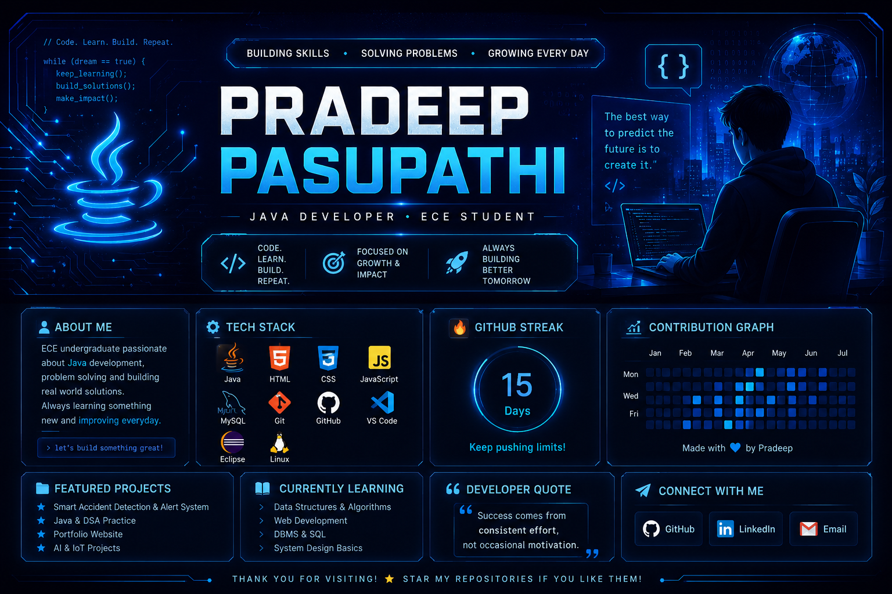

<div align="center">
<p align="center">
  
</p>
<a href="https://github.com/pradeepdcruze">

</a>

<a href="https://www.linkedin.com/in/pradeeppasupathi">

</a>

<a href="mailto:YOUR_EMAIL@gmail.com">

</a>

</p>


</div>

---

# 💫 About Me

```yaml
Name        : Pradeep Pasupathi

Education   : B.E Electronics and Communication Engineering

Learning    : Java • DSA • Web Development

Interested  : Software Development
              Open Source
              Cloud Computing

Goal        : Software Engineer
```

---

# ⚡ Tech Stack

<div align="center">


</div>

---
## 📈 Contribution Graph

<p align="center">
  
</p>
---
# 🔥 GitHub Streak

<div align="center">


</div>

---

# 📈 Contribution Activity

<div align="center">


</div>

---

# 🚀 What I'm Currently Doing

<div align="center">

| 🌱 Learning | 💻 Building | 🎯 Goal |
|:-----------:|:-----------:|:-------:|
| Java & DSA | Personal Projects | Software Engineer |

</div>

---

# 📂 Featured Projects

> ⭐ Pin your best repositories on your GitHub profile so they automatically appear below your README.

- 🚗 Smart Accident Detection & Alert System
- ☕ Java & DSA Practice
- 🌐 Portfolio Website
- 🤖 AI / IoT Mini Projects

---

# 🌐 Connect With Me

<p align="center">

<a href="https://www.linkedin.com/in/pradeeppasupathi">

</a>

<a href="mailto:YOUR_EMAIL@gmail.com">

</a>

<a href="https://github.com/pradeepdcruze">

</a>

</p>

---
# 💬 Developer Quote

<div align="center">


</div>

---

# 🎯 2026 Goals

<div align="center">

| Goal | Status |
|:----|:------:|
| ☕ Master Java | 🚀 In Progress |
| 🧠 Strengthen DSA | 🚀 In Progress |
| 💻 Build Real Projects | 🚀 In Progress |
| 🌐 Contribute to Open Source | 🎯 Planned |
| 💼 Get Placed as a Software Engineer | 🎯 Target |

</div>

---

# ✨ Fun Facts

```text
💡 I enjoy solving coding problems.
📚 I learn something new every day.
⚡ I believe consistency beats perfection.
🚀 Every project teaches me something valuable.
```

---

<div align="center">

## ⭐ Thanks for Visiting My Profile!

*"Code. Learn. Build. Improve. Repeat."*


</div>
